# clin-jeremy-projet6

An OpenClassrooms project: "Build a web app using Java from scratch".

## Physical Data Model (MPD)

```mermaid
erDiagram
    USER ||--o{ TRANSFER : "sends"
    USER ||--o{ TRANSFER : "receives"
    USER ||--o{ USER_CONNECTION : "adds"
    USER ||--o{ USER_CONNECTION : "is added by"

    USER {
        int id PK "AUTO_INCREMENT"
        varchar(30) username UK "NOT NULL"
        varchar(255) email UK "NOT NULL"
	    varchar(60) password "NOT NULL, BCrypt hash"
        decimal balance "NOT NULL, DEFAULT 0.00"
    }

    TRANSFER {
        int id PK "AUTO_INCREMENT"
        int sender_id FK "nullable, ON DELETE SET NULL"
        int receiver_id FK "nullable, ON DELETE SET NULL"
        varchar(200) description "nullable"
        decimal amount "NOT NULL"
        timestamp created_at "NOT NULL, DEFAULT CURRENT_TIMESTAMP"
    }

    USER_CONNECTION {
        int adder_id PK,FK "ON DELETE CASCADE"
        int added_id PK,FK "ON DELETE CASCADE"
    }
```

**Note:** `balance` and `amount` are `DECIMAL(10,2)` not `DOUBLE`. Binary floating-point types cannot represent decimal values exactly, which
would cause rounding errors to accumulate across transactions.